# KiBridge
---

#### How to use KiBridge:

 - Select a token

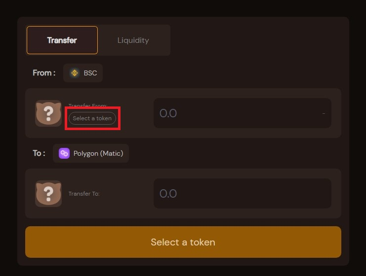
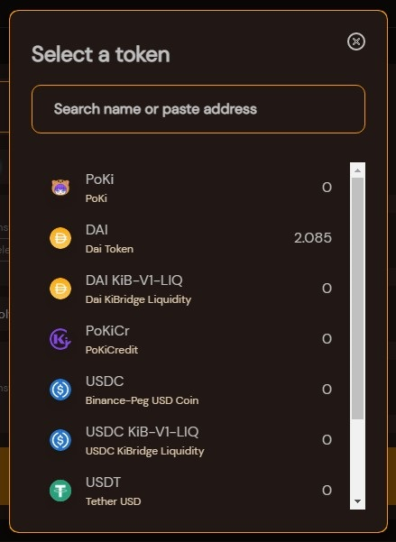
 - Enter an amount 

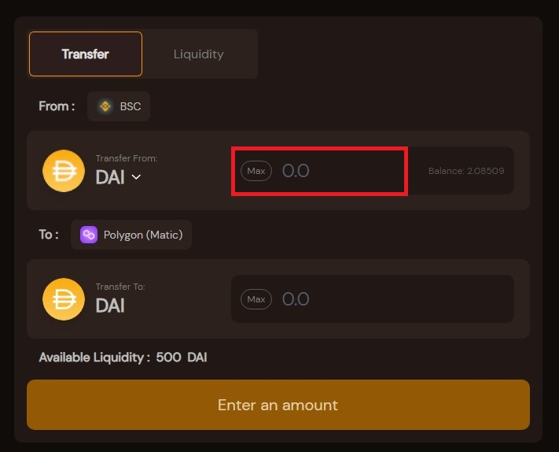
 - Approve 

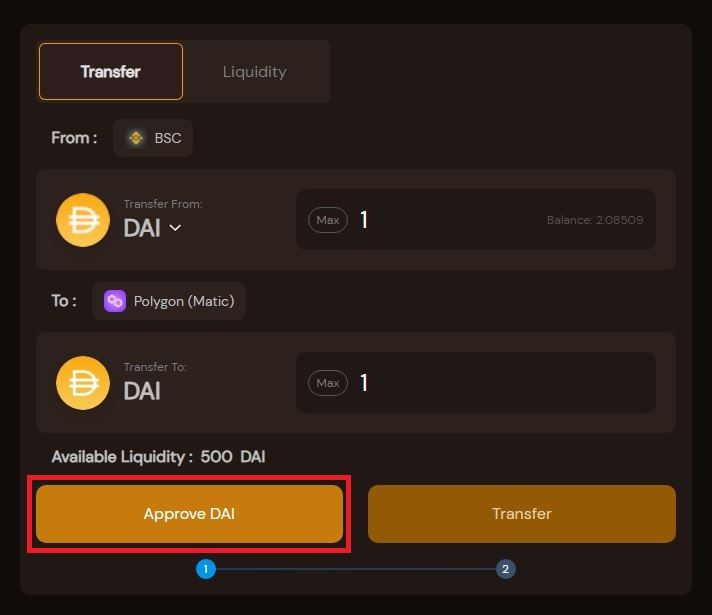
 - Approve In Wallet

 - Transfer

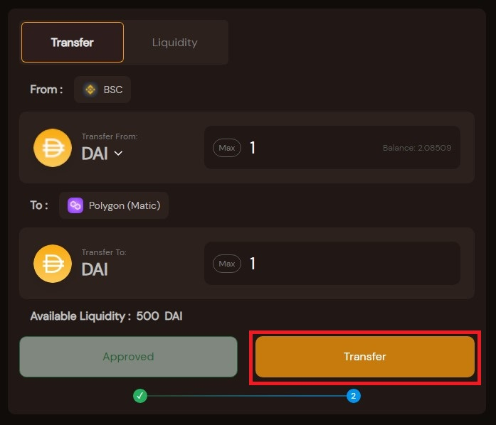
 - Confirm Transfer

 - Confirm Transfer In Wallet

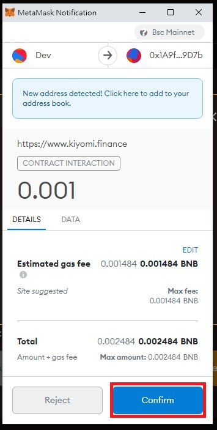
 - Request Pending

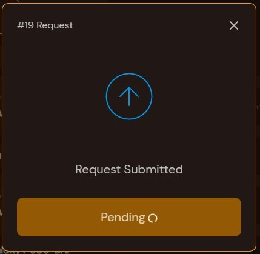
 - Please Wait Node Fulfilling

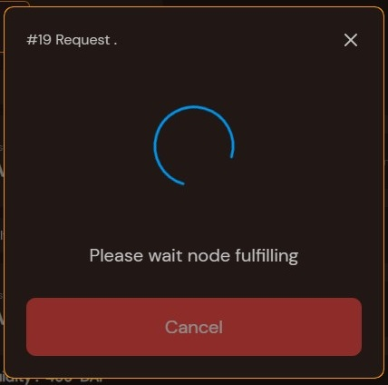
 - Change Network To Claim

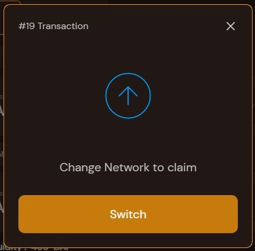
 - Switch Network In Wallet

 - Claim

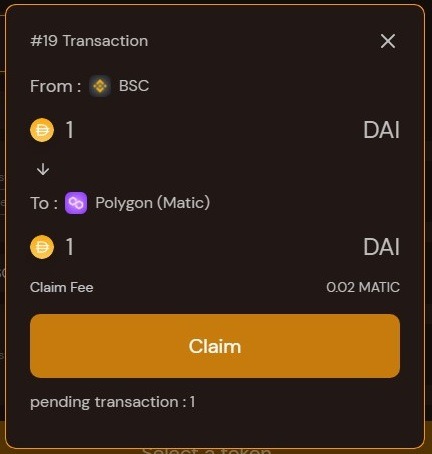
 - Confirm in Wallet

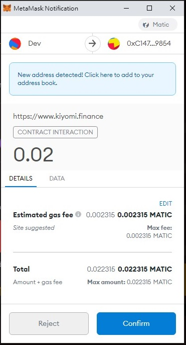
 - Please Wait Node Fulfilling

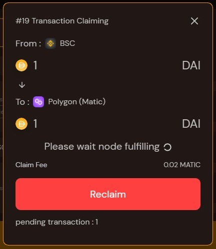
 - Finished

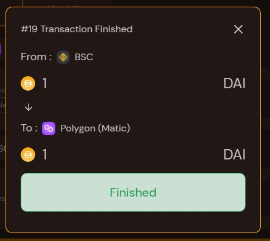
