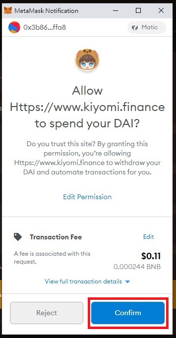
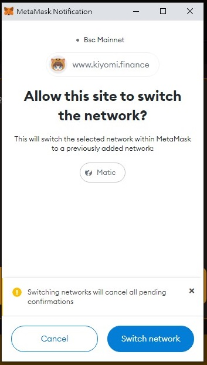

# KiBridge
---

#### How to use KiBridge:

 - Select a token

 - Enter an amount 

 - Approve 

 - Approve In Wallet

 - Transfer

 - Confirm Transfer

 - Confirm Transfer In Wallet

 - Request Pending

 - Please Wait Node Fulfilling

 - Change Network To Claim

 - Switch Network In Wallet

 - Claim

 - Confirm in Wallet

 - Please Wait Node Fulfilling

 - Finished

